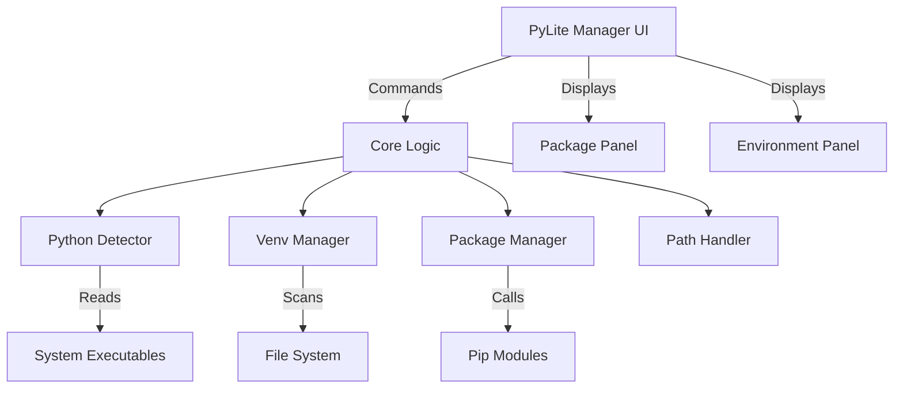

<div align="center">
  
  <h1>🚀 PyLite Manager</h1>
  <h3>Python Virtual Environment & Package Manager GUI</h3>

  <p><b>Manage Python installations, virtual environments, and pip packages — all from a clean desktop GUI.</b></p>
  <p>No more terminal juggling.</p>

  [](https://www.python.org/)
  []()
  []()
  []()
</div>

---
## ✨ What is PyLite Manager?

**PyLite Manager** is a lightweight desktop application that helps you:

- Manage Python installations  
- Handle virtual environments (venv)  
- Install, update, and remove pip packages  

All through an intuitive **Tkinter-based GUI**, without relying on the terminal.

Perfect for developers who want a **visual Python environment manager** instead of CLI-heavy workflows.

---
## ✨ Features

- **🌐 Cross-Platform:** Fully supports Windows, Linux, and macOS environments!
- **🔍 Auto-Detection:** Automatically detects Python installations registered with standard tools (`py`, `which`, PATH).
- **📦 Package Manager GUI:** Install, update, downgrade, and uninstall pip packages effortlessly.
- **📊 Package Insights:** Check quick package statistics for the selected Python/venv target.
- **📄 Requirements Import/Export:** Instantly generate or install from `requirements.txt` with a single click.
- **📂 Virtual Environments:** Recursively discover and manage virtual environments across multiple directories.
- **🧬 Venv Backup & Clone:** Backup a virtual environment as a zip and clone it into a new location.
- **🧹 Python Install Maintenance (Windows):** Open install location, launch uninstaller, and set default Python in user PATH.
- **⚡ Blazing Fast UI:** Built with Tkinter with multi-threading and a modern striped UI.
- **🛠 System Integration:** Open interactive shell terminals configured precisely for the selected environment.

## 🚀 Quick Start

### Requirements
- **Python 3.9+**
- `tkinter` and `pip` (included in most Python distributions)

### Download & Run

- **Windows:** Download and run [dist/PyLite_Manager.exe](dist/PyLite_Manager.exe).
- **Linux/macOS (non-Windows):** No executable is provided. Run with script:

```bash
python3 main.py
```

### Installation

```bash
git clone <repository-url>
cd PyLite_Manager
python3 main.py
```

## 🏗 Architecture

We've organized the application to separate UI components from core processing safely. It relies entirely on standard libraries for security and lightweight deployment.



## 💻 Usage & Workflows

1. **Launch**: Start via `python main.py`.
2. **Discover**: Add scan folders in the left panel to discover scattered virtual environments instantly.
3. **Manage Packages**: Select an environment, and seamlessly update or search packages on the right panel.
4. **Check Stats**: Click **Stats** for package count and version distribution insights.
5. **Export/Import Requirements**: Snapshot or restore environment state using `requirements.txt`.
6. **Backup/Clone Venvs**: Right-click an environment to backup or clone it.
7. **Set Defaults**: (Windows only) Set your desired global Python version effortlessly.

## 🛠 Troubleshooting

<details>
<summary><b>tkinter not found?</b></summary>
Ensure you have the tkinter module installed.
<ul>
  <li><b>Ubuntu/Debian:</b> <code>sudo apt install python3-tk</code></li>
  <li><b>Fedora:</b> <code>sudo dnf install python3-tkinter</code></li>
  <li><b>macOS:</b> <code>brew install python-tk</code></li>
</ul>
</details>

<details>
<summary><b>Environments taking long to load?</b></summary>
Try refining your scan directories to deeper levels to prevent scanning extensive root system drives. Background processes keep the UI responsive, but minimizing search depth is always faster.
</details>

---

## 🔍 Keywords (for discoverability)

python virtual environment manager, pip gui, python package manager gui, tkinter app, venv manager, python desktop tool

## 🤝 Contributing

Contributions are heavily encouraged! PyLite Manager is designed with minimal external dependencies.
Please feel free to submit pull requests or raise issues.

---
<div align="center">
  <i>Let's make Python development easier together.</i>
</div>
