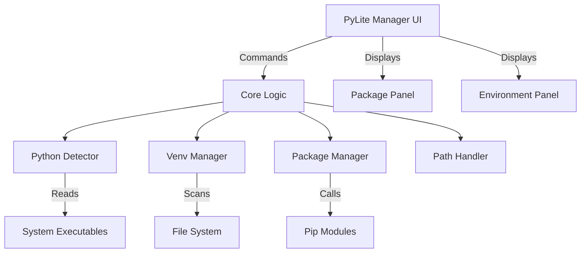

<div align="center">
  
  <h1>🚀 PyLite Manager</h1>
  <p><b>A modern, cross-platform desktop application to seamlessly manage Python installations, virtual environments, and packages.</b></p>

  [](https://www.python.org/)
  []()
  []()
  []()
</div>

---

## ✨ Features

- **🌐 Cross-Platform:** Fully supports Windows, Linux, and macOS environments!
- **🔍 Auto-Detection:** Automatically detects Python installations registered with standard tools (`py`, `which`, PATH).
- **📦 Advanced Package Management:** View, search, install, update, downgrade, and uninstall pip packages effortlessly.
- **📄 Requirements Import/Export:** Instantly generate or install from `requirements.txt` with a single click.
- **📂 Virtual Environments:** Recursively discover and manage virtual environments across multiple directories.
- **⚡ Blazing Fast UI:** Built with Tkinter with multi-threading and a modern striped UI.
- **🛠 System Integration:** Open interactive shell terminals configured precisely for the selected environment.

## 🚀 Quick Start

### Requirements
- **Python 3.9+**
- `tkinter` and `pip` (included in most Python distributions)

### Download & Run

- **Windows**: Download and run the executable from the `dist` folder:
  - `dist/PyLite_Manager.exe`
- **Linux/macOS (non-Windows)**: No executable is provided. Please run the app using the Python script:
  - `python main.py`

### Installation

```bash
git clone <repository-url>
cd PyLite_Manager
python3 main.py
```

## 🏗 Architecture

We've organized the application to separate UI components from core processing safely. It relies entirely on standard libraries for security and lightweight deployment.



## 💻 Usage & Workflows

1. **Launch**: Start via `python main.py`.
2. **Discover**: Add scan folders in the left panel to discover scattered virtual environments instantly.
3. **Manage Packages**: Select an environment, and seamlessly update or search packages on the right panel.
4. **Export Requirements**: Click **Export** to quickly snapshot the environment state.
5. **Set Defaults**: (Windows only) Set your desired global Python version effortlessly.

## 🛠 Troubleshooting

<details>
<summary><b>tkinter not found?</b></summary>
Ensure you have the tkinter module installed.
<ul>
  <li><b>Ubuntu/Debian:</b> <code>sudo apt install python3-tk</code></li>
  <li><b>Fedora:</b> <code>sudo dnf install python3-tkinter</code></li>
  <li><b>macOS:</b> <code>brew install python-tk</code></li>
</ul>
</details>

<details>
<summary><b>Environments taking long to load?</b></summary>
Try refining your scan directories to deeper levels to prevent scanning extensive root system drives. Background processes keep the UI responsive, but minimizing search depth is always faster.
</details>

## 🤝 Contributing

Contributions are heavily encouraged! PyLite Manager is designed with minimal external dependencies.
Please feel free to submit pull requests or raise issues.

---
<div align="center">
  <i>Built to blow minds. 🧠 Let's make Python development easier together.</i>
</div>
